# FLOODS-RS-2024

**The May 2024 floods in the small cities of Rio Grande do Sul, Brazil.** A reproducible analysis of which buildings the flood of May 2024 reached in the 59 municipalities of the Rio Pardo and Taquari valleys.

It rebuilds, in Python, the geospatial analysis behind the paper
[*Extreme weather events and their socio-spatial impacts on small cities in Rio Grande do Sul, Brazil*](https://www.rbgdr.net/revista/index.php/rbgdr/article/view/8020)
(Detoni, Faccin, Silveira, Rorato & Machado, 2025), first produced in a few weeks in 2024 as a technical report for regional decision-makers. It checks the results against the numbers the paper reports.

## Key results

- **43,600 buildings reached by the flood** in the two valleys: 26,633 in the Taquari valley and 16,967 in the Rio Pardo valley. That is 8.7% of all buildings, and 11.6% of the buildings in urban census tracts.
- **Small towns were hit hardest.** The flood reached about half the urban buildings of Marques de Souza (54%) and Muçum (51%), and more than 40% in Roca Sales, Cruzeiro do Sul and Estrela.
- **Mostly urban damage.** 69% of the flooded buildings were in urban census tracts, which hold 52% of all buildings in the two valleys.
- **Venâncio Aires (7,502) and Estrela (6,495) had the most flooded buildings**, followed by Cruzeiro do Sul, Encantado, Santa Cruz do Sul and Lajeado.

## Figures

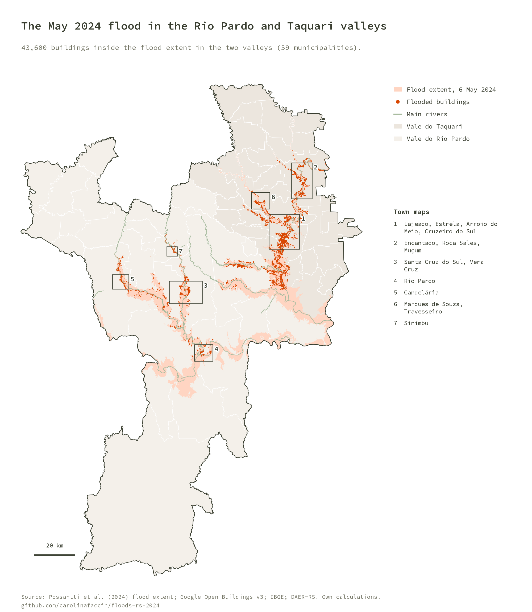

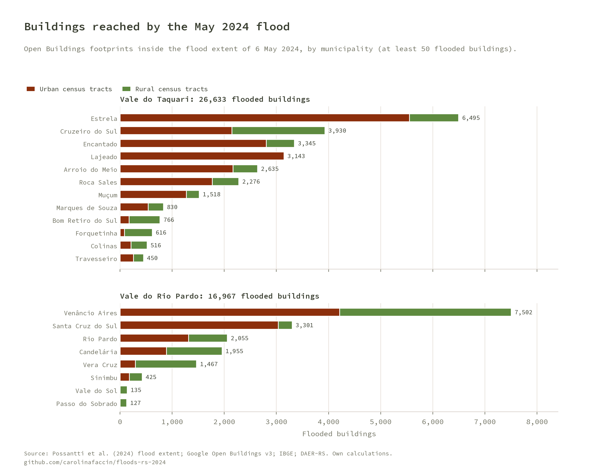

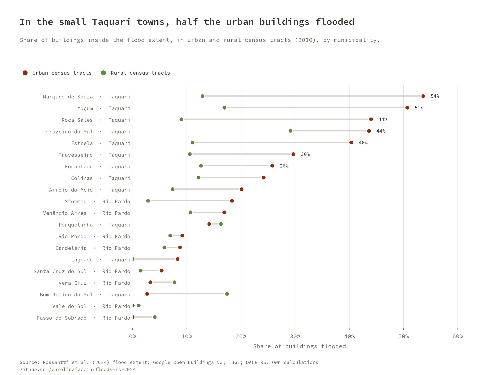

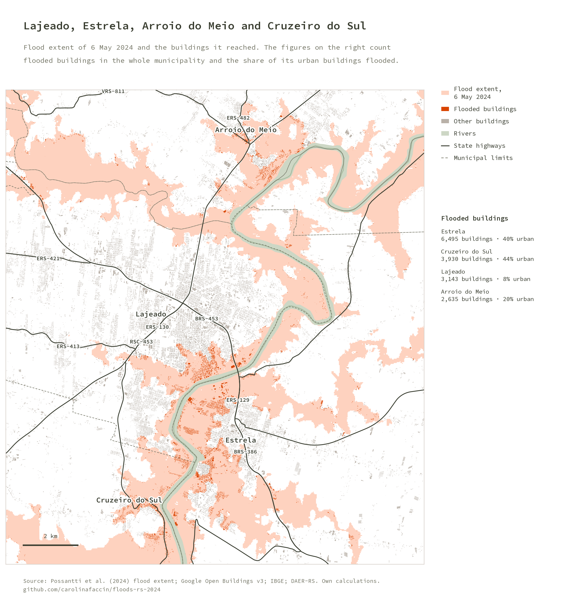

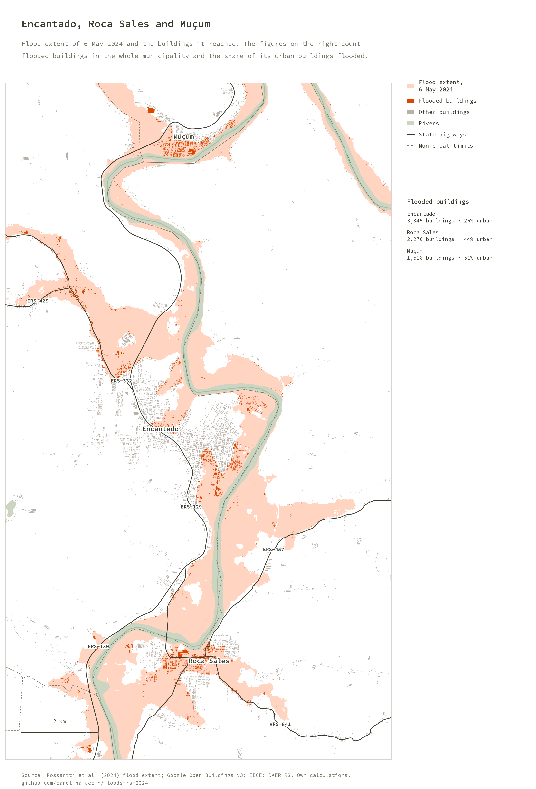

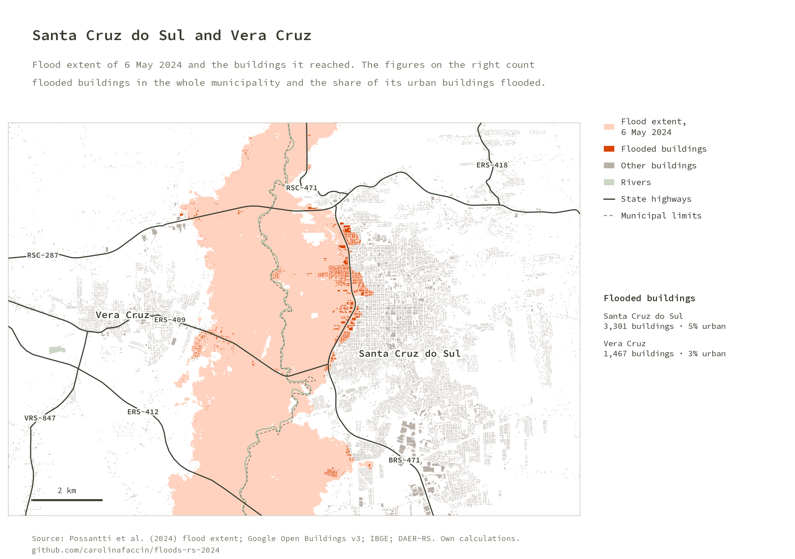

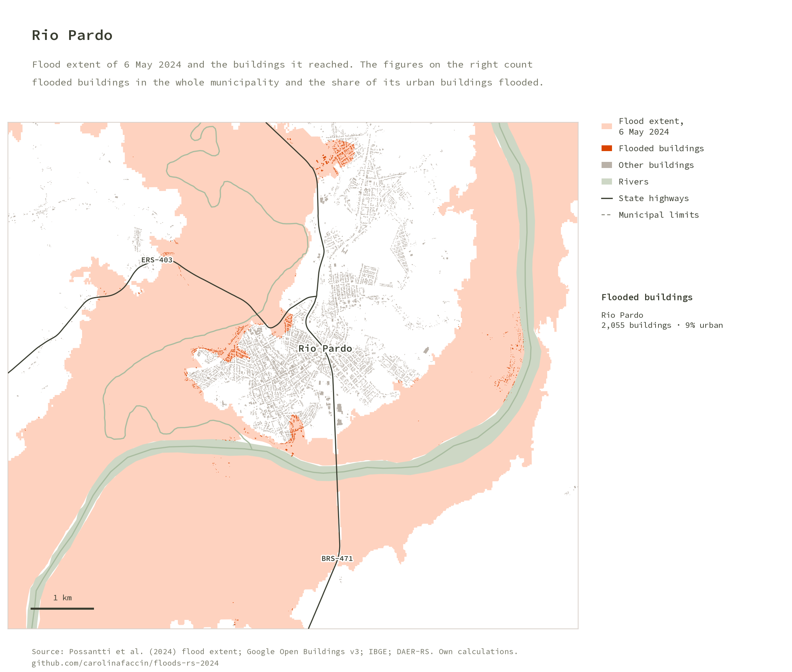

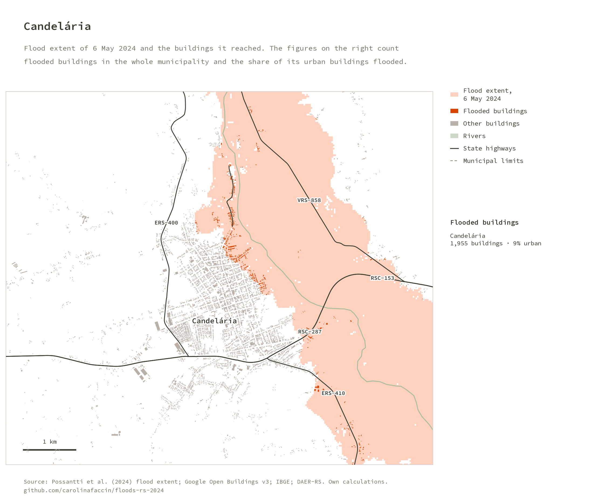

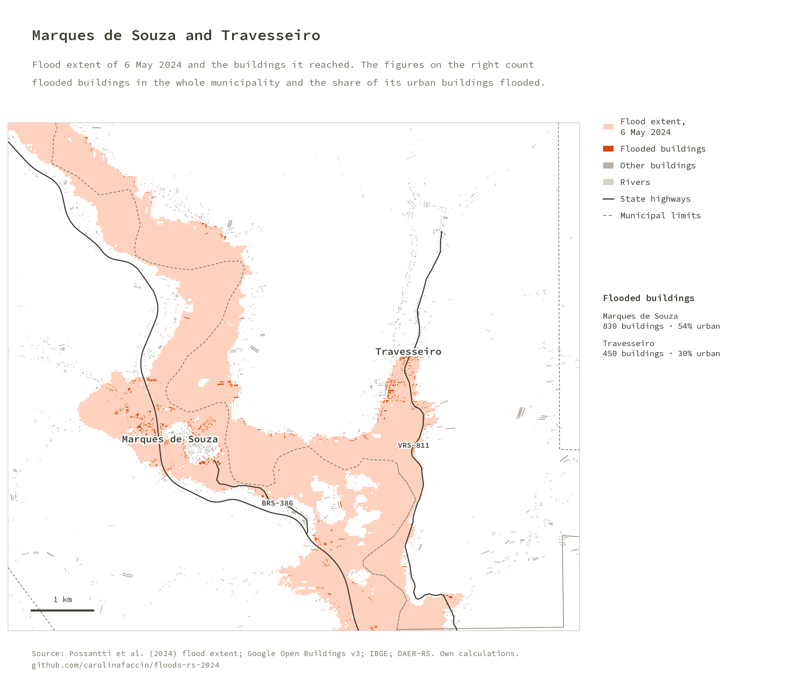

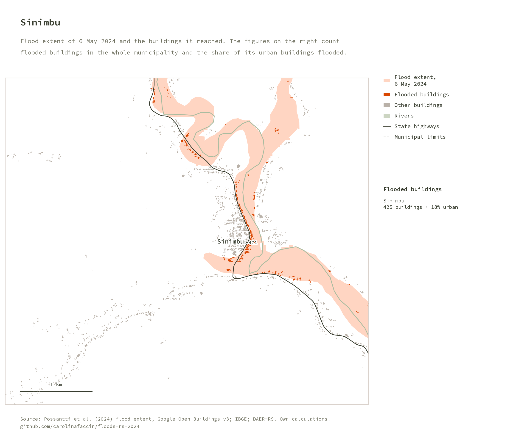

## How it works

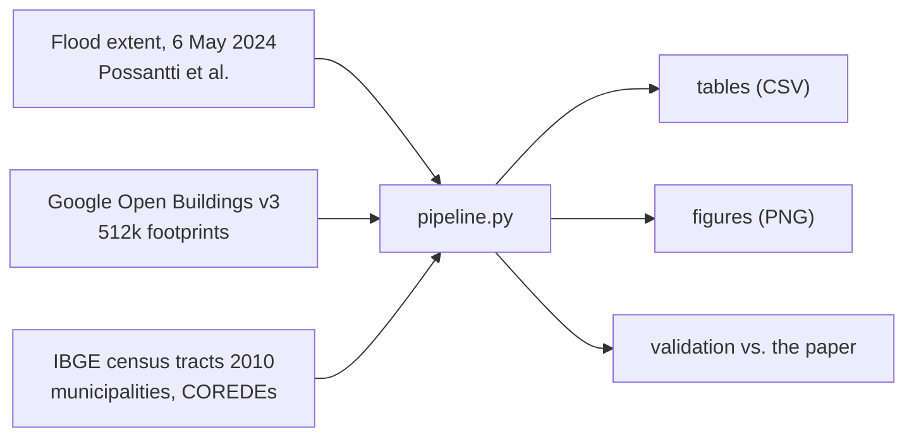

1. **Flood extent.** The flooded area observed on satellite images of 6 May 2024 for the Guaíba hydrographic region (Possantti et al., 2024).
2. **Buildings.** Google Open Buildings v3 footprints for the valleys (confidence of at least 0.075). A building counts as flooded when its footprint touches the flood extent, as in the 2024 analysis. A stricter test, centroid inside the extent, gives 6% fewer (40,885) and is kept in the tables.
3. **Urban or rural.** Each building takes the situation (urban or rural) of the 2010 census tract that contains it, and its municipality.
4. **Region.** Municipalities of the Vale do Rio Pardo and Vale do Taquari COREDE regions.
5. **Maps.** Town maps add rivers (IBGE) and state highways (DAER-RS).

## Run it

```bash
python -m venv venv && source venv/bin/activate
pip install -r requirements.txt
cp config/config.local.json.example config/config.local.json   # set sources_dir and outputs_dir
python pipeline.py                               # tables + figures + README images
python pipeline.py --only figures docs           # redraw figures only
pytest                                           # unit tests + validation against the paper
```

The first run reads the 512k footprints (a few minutes) and caches them in `outputs_dir/cache/buildings.parquet`.

`config/config.local.json` (gitignored) sets two folders:

| Key | Purpose |
|---|---|
| `sources_dir` | Shared raw-data catalog. Reads the 2024 GIS project from `_projetos/rio_pardo_enchentes_2024/shp/` (flood extent, census tracts, rivers, highways), the footprints from `google/open_buildings/vales_rs_2024/t1/` and the COREDE list from `spgg_rs/coredes/t1/` |
| `outputs_dir` | This project's outputs: `tables/`, `figures/`, `cache/` |

## Outputs (`outputs_dir`)

| File | Content |
|---|---|
| `tables/flooded_by_municipality.csv` | Buildings and flooded buildings by municipality, urban and rural, with shares |
| `tables/flooded_by_valley.csv` | The same by valley and for both valleys |
| `tables/comparison_with_paper.csv` | Computed vs. published values |
| `figures/*.png` | All figures (copied to `docs/img/` for this README) |

## Validation

`pipeline.py` stops with an error if a count drifts more than 1% from the published value, or a share more than 0.5 percentage points.

| Check | Published | Computed |
|---|---|---|
| Flooded buildings, Vale do Rio Pardo | 16,967 | 16,967 |
| Flooded buildings, Vale do Taquari | 26,624 | 26,633 |
| Arroio do Meio / Cruzeiro do Sul / Estrela / Lajeado | 2,635 / 3,942 / 6,500 / 3,122 | 2,635 / 3,930 / 6,495 / 3,143 |
| Share of urban and rural buildings flooded, 23 municipalities (46 values) | Quadros 1 and 2 | all within 0.4 points |

## Notes on the data

- **An approximation.** The flood extent comes from satellite images of one day and the footprints from a model; as the paper says, the counts are approximate values, not a damage survey.
- **Census tracts of 2010.** The urban/rural split uses the 2010 tracts, as in 2024, because the 2022 tracts were not yet available when the report was written.

## Repository layout

```
pipeline.py            orchestrator (tables, figures, docs)
src/floods/
  config.py            paths from config/config.local.json
  data.py              flood extent, buildings, context layers
  metrics.py           flooded buildings by municipality and valley, comparison with the paper
  figures.py           figures
  style.py             figure style: source line and repository name
  brand.py             visual identity (colors, palettes, Source Code Pro, layout); copied
                       from the author's brand repository, do not edit here
tests/                 synthetic unit tests + validation against the paper
assets/fonts/          Source Code Pro (SIL OFL)
```

## Credits

Paper: Detoni, Faccin, Silveira, Rorato & Machado (2025). *Extreme weather events and their socio-spatial impacts on small cities in Rio Grande do Sul, Brazil.* Revista Brasileira de Gestão e Desenvolvimento Regional, 21(1).

Data: flood extent by [Possantti et al. (2024)](https://zenodo.org/records/11177244); [Google Open Buildings](https://sites.research.google/open-buildings/) (CC BY 4.0); [IBGE](https://www.ibge.gov.br/); DAER-RS; SPGG-RS. Figures use the Source Code Pro typeface (SIL Open Font License).

## License

GNU General Public License v3.0, see [LICENSE](LICENSE).
